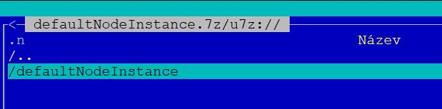
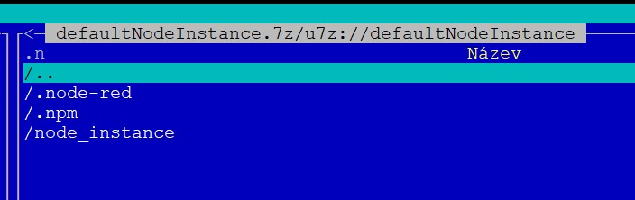

# Dvestezar Terminal Manager - Debian Based
<!-- cspell:ignore submoduly,submodul,symlinku,pipx,venv,pipreqs,ensurepath,pushurl,utilitku,standartní -->

v1.3.1

## Popis aplikace

Dvestezar Terminal Manager je nástroj pro správu systémů založených na Debianu, jako jsou Ubuntu, Raspbian, OrangePi a další distribuce. Poskytuje jednoduché menu pro ovládání různých funkcí systému přímo z terminálu.

Tento nástroj je navržen jako modulární framework, který lze snadno rozšiřovat o nové podaplikace a funkce podle potřeb. 

**Aktuální funkce aplikace:**
1. **User Management:**
   - Správa uživatelů systému včetně přidávání, mazání a nastavování hesel.
   - Generování a správa SSH klíčů s automatickým ukládáním do `authorized_keys`.
   - Správa přístupu uživatelů k sudo.

2. **Node-RED Instance Manager:**
   - Vytváření, editace, zálohování a mazání instancí Node-RED.
   - Správa šablon pro rychlé nasazení nových instancí.
   - Automatická kontrola a konfigurace služeb pro každou instanci.

---

### Výzva k rozšíření

Aplikace je připravena na rozšiřování o další moduly a podaplikace. Pokud máš nápad na novou funkcionalitu nebo chceš přidat podporu pro specifickou službu, jsi vítán!

Každý nový modul může být jednoduše přidán jako nová podaplikace do adresáře `libs/app/menus/<app_dir>`. Tato struktura umožňuje snadnou integraci do hlavního menu a přehlednou správu kódu.

---

## Popis vytváření menu aplikací

Hlavní menu se vytváří tak, že projde `libs/app/menus/<app_dir>` kde `app_dir` je adresář aplikace, který musí obsahovat`:
- `menu.py` tento soubor musí obsahovat:
  - property `_MENU_NAME_` které obsahuje text zobrazený pro volbu v hlavním neu
  - class `menu` které bude z hlavního menu voláno jako výchozí menu aplikace

### Node-Red Instance Control

**Node-Red Instance Control** je nástroj pro správu instancí Node-RED, který umožňuje konfigurovat a spravovat jednotlivé instance na serveru. Aplikace poskytuje uživatelsky přívětivé menu přímo v terminálu, které vám umožní snadno provádět různé úkony, jako je vytváření, úprava, zálohování a mazání instancí Node-RED. Tento nástroj je určen zejména pro efektivní správu instancí v multi-uživatelském prostředí, kde každý uživatel může mít svou vlastní instanci Node-RED.

#### Hlavní funkce aplikace:

1. **Nastavení nových instancí a jejich úprava**:
   - Možnost vytvoření nové instance Node-RED pro konkrétního systémového uživatele.
   - Úprava stávajících instancí, včetně změny názvu, hesla, portu nebo typu instalace (např. čistá instalace nebo instalace z archivu).
   - Nastavení služby na čtení nebo plný přístup.

2. **Správa služeb Node-RED**:
   - Spuštění, zastavení a zakázání služby Node-RED.
   - Možnost ověřit stav služby pro konkrétního uživatele.

3. **Zálohování a obnovení**:
   - Automatické zálohování všech instancí nebo jednotlivých instancí Node-RED.
   - Vytvoření zálohy aktuální konfigurace a uživatelských dat.

4. **Šablony služeb**:
   - Možnost vytvoření šablony služby Node-RED, která slouží jako výchozí pro nové instance.
   - Odinstalace či odstranění šablon služby.

5. **Správa uživatelů**:
   - Přidání nového uživatele.
   - Nastavení a úprava uživatelského přístupu do Node-RED Dashboard-u.
   - Možnost nastavit uživatele na režim pouze pro čtení nebo plný přístup.

#### Menu a ovládání

- **Hlavní menu** nabízí přehled o konfiguraci, jako je URL serveru, adresáře pro zálohy, dočasné adresáře a výchozí instance. Můžete zde provést akce, jako je vytváření nebo úprava instancí, zálohování, nebo vytvoření šablony.
- **Editační menu** umožňuje detailně konfigurovat konkrétní instance – měnit porty, názvy, přístupy a další parametry.
- **Uživatelské menu** poskytuje možnosti pro přidávání uživatelů, nastavení přístupů, a správu jednotlivých uživatelských profilů.

#### Typ instalace

- **Fresh**: Čistá instalace z repozitáře, vhodná pro nové uživatele nebo vytvoření zcela nové instance.
- **Copy**: Instalace z existujícího archivu, která umožňuje rychlé obnovení nebo klonování předchozí konfigurace.

#### Další vlastnosti

- **Bezpečnost a přístup**: Uživatelé mohou být nastaveni s úrovněmi oprávnění "full" a "pouze pro čtení", což je vhodné pro auditní nebo kontrolní účely.

Tento nástroj zjednodušuje správu více instancí Node-RED v jednom prostředí a nabízí flexibilitu při správě jednotlivých uživatelů, což zajišťuje efektivitu a konzistenci v provozu. 

### SSH MANAGER

Manager spravuje certifikáty ssh SSH pro připojení k terminálu, ale lze využít jakkoliv.

Je určeno hlavně pro správce serveru. Např správa instancí např node-red, kde vytvoříme instanci a na ni pak vytvoříme SSH klíč pro uživatele, který se může připojit pro debug node-red

Spravuje přímo soubor uživatelů `authorized_keys`

- Spravovat uživatele systému:
  - vytvořit uživatele systému
  - nastavit heslo uživatele systému
  - smazat uživatele systému, nejdřív je ale provedena záloha home adresáře uživatele a po úspěchu je uživatel kompletně smazán ze systému vč. dat home adresáře.
- v home uživatele vytvoří v `~/.ssh/sshManager` kde ukládá generované klíče
- generované klíče může:
  - zobrazi privátní klíč pro předání uživateli
  - zahrnout nebo vyřadit do/z `authorized_keys`

## Hlavní soubor

Spouštíme pomocí `!run.py`

## Requires

Co je potřeba ke spuštění

### Soubory


**Nutné pro běh:**

- `config.ini` je potřeba vytvořit před prvním spuštěním podle `cfg.py`

**Doporučené:**

- `/home/defaultNodeInstance.7z` výchozí zabalený adresář s instancí, (není povinné)  
  Tento soubor může obsahovat kompletní instanci node-red v dané verzi, nainstalovanými moduly a základní flow  
  Uvnitř musí být jako root dir adresář se jménem `defaultNodeInstance` a v něm je vpodstatě zabalený (jen potřebný obsah) home uživatelského adresáře  
    
    

### Systém

Testováno na Ubuntu 22+

### Python

Testováno na python 3.10+

### Python knihovny

Viz [soubor](requirements.txt)

Lze instalovat pomocí souboru [níže](#rq_try_install_requirementspy)

### Aplikace z apt

**7zip:**

```sh
apt install p7zip-full
```

**Node.js:**

Pro bezproblémovou funkčnost musí být node.js instalován globálně, pro aktuální LTS 22 je to takto:

Provádíme pod sudo nebo se sudo příkazem

```sh
curl -fsSL https://deb.nodesource.com/setup_22.x | sudo -E bash -
sudo apt-get install -y nodejs
```


### Submoduly

Tato app používá submodul 'JBLibs-python', takže po naklonování tohoto repo je potřeba:

```sh
git submodule update --init --recursive
```

Nebo přímé přidání, pokud by nic se submoduly nefungovalo

```sh
git submodule add -b <branch> https://github.com/dvestezarzlkl/JBLibs-python.git libs/JBLibs
```

## Soubory v root adresáři

### `!run.py`

Hlavní soubor kterým se app spouští

### `sys_apps.sh`

Soubor kterým lze spustit `!run.app` z linku.

**Př. globální spuštění bez modifikace PATH:**

Vytvoříme link do `/usr/local/bin` a v systému pak stačí napsat kdekoliv `sys_app.sh` nebo jiný název podle názvu symlinku.

např:

```sh
ln -s /cesta/k/tvemu_skriptu/sys_apps.sh /usr/local/bin/sys_apps
```

Toto vytvoří symlink pro příkaz `sys_apps` který lze potom odkudkoliv spustit.

### `rq.sh`

Generuje requirements.txt, knihovny které nejsou standartní součástí pythonu

**Soubor:**

- `requirements.txt` obsahuje seznam potřebných knihoven, které můžeme doinstalovat
  - `pip install -r requirements.txt` pro venv
- `rq.log` - poslední log i verzí pythonu pro které bylo generováno

#### Co potřebuje

utilitku `pipreqs`

Pokud máme např čistý ubuntu server kde je python3, a chceme nainstalovat globálně, kde nefunguje pip kvůli externí správě (apt), tak budeme potřebovat `pipx`

Instalace pip

```sh
apt install python3-pip
```

a pipx: 

```sh
apt install pipx

pipx install pipreqs

# čteme info co zobrazí a popřípadě, pokud potřebujeme

pipx ensurepath

```

**PO TOMTO KROKU je nutné restartovat terminál !!!!**

Pokud chceme instalovat v prostředí venv tak postup je viz. venv prostředí.

### `rq_try_install_requirements.py`

!! Jen pro globální instalaci knihoven !! a je potřeba mít admin práva !!!

Soubor se pokusí instalovat `requirements.txt` přes apt a pak pipx

Pokud je v requirements modul s prefixem 'python_' tak se následně pokusí instalovat bez tohoto prefixu

Pokud chceme instalovat v rámci prostředí tak stačí

```sh
pip install -r requirements.txt
```

### `update_from_git.sh`

!!! Script může zrušit nebo přepsat lokální změny !!!

Aktualizuje lokální repo podle aktuálního stavu na GITu. Pokud tu budeme mít nějaké změny tak budou anulovány.

Script má základní ochranu na test přepnutí lokálního repo do readonly, pokud není provedeno, script se nespustí.

**Přepnutí do readonly:**

Lokální repo přepneme do readonly pomocí příkazu z terminálu

```sh
git config remote.origin.pushurl no_push
```

### `makeRelease.py`

Zabalí tento adresář do ZIP jen se soubory a adresáři, které jsou potřeba a výsledný soubor uloží do podadresáře `release`.

Adresář `release` nebude součástí ZIP a je v `gitignore`

### logy, __pycache__

Tyto nebudou součástí `release` a  jsou v `gitignore`

## Práva souborů

Spustitelné soubor musí mít samozřejmě práva pro spuštění

Např. pro základní skripty

```sh
chmod +x '!run.py' 'sys_apps.sh'
```
