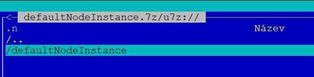
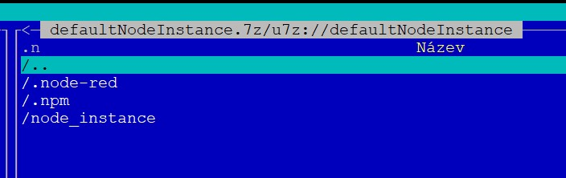

# Dvestezar Terminal Manager - Debian Based
<!-- cspell:ignore submoduly,submodul,symlinku,pipx,venv,pipreqs,ensurepath,pushurl,utilitku,standartní -->

v2.2.3

[ENG](readme_en.md)

[Náhled](preview_v1-3-1.mp4)

## Instalace

Viz níže sekce [Soubory v root adresáři](#soubory-v-root-adresáři) a [Requires](#requires)

**setup.sh**

## Popis aplikace

Dvestezar Terminal Manager je terminálový správce pro Debian-based systémy jako Ubuntu, Debian, Raspbian nebo Orange Pi. Aplikace staví na modulárním menu systému, kde se jednotlivé části načítají jako samostatné pluginy z adresáře `libs/app/menus/app_*`.

Hlavní menu automaticky načte každý plugin, který obsahuje `menu.py`, takže je možné aplikaci rozšiřovat o další systémové nebo servisní nástroje bez zásahu do hlavního menu.

## Aktuální pluginy v menu

### Disk manager

- výpis fyzických disků, partací a image souborů
- mount a unmount partací i `.img` souborů přes loop zařízení
- práce s mountpointy a kontrola, zda je adresář vhodný pro připojení
- operace nad disky a partacemi včetně formátování, shrink a rozšíření partice
- pomocné operace pro zálohování a práci se souborovými systémy

### Swap manager

- vytvoření nového SWAP image souboru
- aktivace, deaktivace a správa existujících SWAP souborů
- zobrazení vytížení RAM a SWAP včetně aktivních SWAP zařízení
- výpis procesů využívajících SWAP
- změna velikosti SWAP image podle stavu systému

### Node-RED manager

- instalace nové Node-RED instance pro systémového uživatele
- editace existující instance včetně názvu, portu a dashboard uživatelů
- start, stop, restart, enable a disable systemd služby instance
- zálohy instancí, full backup, seznam záloh a kontrola integrity
- správa service template, sudoers pravidel a HTTPS certifikátů
- spuštění instance jako aplikace, včetně SAFE MODE
- správa globální instalace Node.js a npm, včetně LTS update a uninstallu

### SSH manager

- přehled systémových uživatelů relevantních pro SSH správu
- vytvoření nového systémového uživatele
- správa SSH klíčů uživatele a `authorized_keys`
- nastavení hesla, sudo oprávnění a skupiny `dialout`
- otevření detailního submenu pro správu konkrétního uživatele

### SFTP manager

- správa SFTP uživatelů definovaných v konfiguraci
- vytváření a mazání SFTP uživatelů
- přidávání a odebírání mountpointů do SFTP jailu
- správa veřejných klíčů a jejich přehled v čitelném tvaru
- přepínání mountpointů do read-only režimu
- uložení a aplikace změn do systému až ve chvíli, kdy je správce potvrdí

Podrobněji viz také [sftp_manager_readme.md](sftp_manager_readme.md).

### UART tester

- detekce relevantních sériových portů přes sysfs
- režim vysílač, příjem a rychlé spuštění uloženého testovacího příkazu
- nastavení portu, baudrate, parity, datových bitů, stop bitů a timeoutu
- uložení konfigurace do souboru a její opětovné načtení při dalším spuštění
- generování testovacího příkazu ve tvaru `test{len}n{repeat}`
- nastavení délky testovacího textu a počtu opakování přímo z menu
- diagnostický UART loopback test běžných rychlostí od 9600 do 2 000 000 Bd
- testovací rámce s indexem a Modbus CRC16, kontrola timeoutů, CRC, dat a cizích bajtů
- průběžný stav testu se na obrazovce přepisuje na jednom řádku a po každé rychlosti zůstane souhrn
- plný verbose výpis každého rámce se ukládá do časově označeného logu v globálním `LOG_DIR`

Podrobněji viz také [uart_tester.md](uart_tester.md).

### ZLKL plugin

- v adresáři `app_50_zlkl` je přítomen externí nebo proprietární modul
- protože neobsahuje `menu.py`, hlavní menu ho aktuálně nenačítá a není součástí běžně dostupných položek

## Co aplikace celkově umí

- sjednotit více administrátorských nástrojů do jednoho terminálového menu
- spravovat storage, swap, Node-RED, SSH, SFTP i UART testování z jednoho místa
- ukládat konfiguraci vybraných pluginů do souborů mimo samotný kód
- udržovat globální runtime konfiguraci aplikace v `/etc/jb_sys_apps/config.ini` přes `libs.app.cfg.load()` a `libs.app.cfg.save()`
- konfigurovat hlavní `SERVER_URL` bez portu a mailing pro celou aplikaci v jednom `App settings` menu
- synchronizovat přes SysApps Hub 2.1 identitu hosta, síťové adresy, administrační služby, Node-RED instance a fyzické disky podle PTUUID do centrální MySQL/MariaDB databáze
- přenášet společné Hub a SMTP nastavení šifrovaným balíkem, ručně nebo read-only z centrální HTTPS URL s revision/SHA ochranou
- používat lokalizované texty přes `lng` soubory
- rozšiřovat systém o další pluginy bez úprav hlavního menu

### Technická dokumentace

- [SysApps Hub 2.1](docs/sysapps-hub.md)
- [Centralizovaná nastavení SysApps](docs/central-settings.md)
- [Plugin systém](docs/plugin-system.md)

### Výzva k rozšíření

Aplikace je připravena na rozšiřování o další moduly a podaplikace. Pokud máš nápad na novou funkcionalitu nebo chceš přidat podporu pro specifickou službu, jsi vítán!

Každý nový modul může být jednoduše přidán jako nová podaplikace do adresáře `libs/app/menus/<app_dir>`. Tato struktura umožňuje snadnou integraci do hlavního menu a přehlednou správu kódu.

## Popis vytváření menu aplikací

Hlavní menu se vytváří tak, že projde `libs/app/menus/<app_dir>` kde `app_dir` je adresář aplikace, který musí obsahovat`:
- `menu.py` tento soubor musí obsahovat:
  - property `_MENU_NAME_` které obsahuje text zobrazený pro volbu v hlavním neu
  - class `menu` které bude z hlavního menu voláno jako výchozí menu aplikace

## Hlavní soubor/y


### `run.sh`

Spouštíme pomocí `run.sh` - spouští aplikaci, tento soubor ale neexistuje dokud se neprovede `setup.sh`


### `setup.sh`

Hlavní instalační soubor `setup.py` který se spouští při prvním spuštění. Instaluje potřebné programy, knihovny, submoduly a další související věci vč. **node.js**, **zip** plus python knihovny potřebné pro aplikaci - zpracuje `requirements.txt`.

!!! Tento soubor je potřeba spustit jako root nebo se sudo právy.

- !!! POZOR (pokud není detekován py3.10) přidává repo pro python 3.10 do apt, takže pokud NECHCEME použít toto repo, tak si vše musíme obstarat a zajistit ručně  
    - Používá repo `dd-apt-repository -y ppa:deadsnakes/ppa` pro python 3.10 - nainstaluje python 3.10, pip, venv a dev knihovny.
- !!! Pozor (pokud není detekováno) node se instaluje globálně do systému z repo ve verzi 22.x - pokud nechceme tak se musíme postarat o instalaci node ručně aby v době spuštění setup.sh byl node dostupný. !!!
- Tento soubor vytváří virtual env pro python 3.10 `venv310` a do něj instaluje potřebné knihovny podle `requirements.txt`

Nakonec pokud neexistuje tak vytvoří symlink pro `sys_apps.sh` do `bin` adresáře, aby bylo možné spouštět aplikaci z terminálu bez nutnosti přepínat se do adresáře aplikace.

### `update_from_git.sh`

Poslední 'neméně' hlavním souborem je `update_from_git.sh` který aktualizuje lokální repo podle aktuálního stavu na GITu. Pokud tu budeme mít nějaké změny tak budou anulovány.  
Script kontroluje jestli je repo v módu readonly, pokud není tak se nespustí a zobrazí hlášení o nutnosti přepnutí do readonly.  
Toto lze provést příkazem z terminálu

```sh
git config remote.origin.pushurl no_push
```
### `assets/portInUse.json` - Seznam instancí v JSON a PHP site

- Pokud je nastaveno tak se soubor JSON a PHP generují vždy při vstupu do menu `Nová/úprava instance`
- Tento soubor je v adresáři `assets` a obsahuje seznam instancí node-red, které jsou aktuálně spuštěny na serveru.
- Kopie tohoto souboru lze nastavit v `config.info` v proměnné `INSTANCE_INFO` např: `INSTANCE_INFO = "/var/www/web"`. Kopie je read pro všechny uživatele, a takto ji lze uložit do webu aby k ní mohlo PHP přistupovat protože u PHP bývá omezeno opendir a nemůže číst soubory mimo web adresář.

Tento soubor se generuje a updatuje pokaždé když se navštíví menu se seznamem instancí, je to json seznam portů které jsou použity pro instance node-red. Lze ho použít kdekoliv je potřeba, např i pro zobrazení pomocí PHP na stránku pro názvy instancí, jejich porty a url

**Příklad:**

```json
{
	"instances": [
		[
			55551,
			"node_instance_1"
		],
		[
			55552,
			"node_instance_2"
		],
      // ...
	],
	"url": "http://moje.domena.url"
}
```

Kopie tohoto souboru lze nastavit v config proměnné `INSTANCE_INFO`, pokud do ní nastavíme adresář, tak se bude tento soubor kopírovat do tohoto adresáře. Např pokud chceme na web umístit info o instancích tak nastavíme kopii do web adresáře, ve kterém např pomocí PHP zobrazíme seznam instancí a jejich porty.

**!!! POZOR !!!** JSON dokáže generovat PHP script pro zobrazení, pro něj jsou v config.ini určeny tyto proměnné:

- **INSTANCE_INFO_COPY_PHP** (bool default `False`) - pokud je `True` tak se bude kopírovat z `assets/php/node_red_instances.php` do adresáře jako je **JSON**
- **SITE_NAME** (string default `"Dvestezar Terminal Manager"`) - název stránky, pro hlavičku a titulky
- **PHP_SCRIPT_CIDRS** (string default `"[ "192.168.0.0/24", "127.0.0.1" ]"`) seznam CIDR adres, které budou mít přístup k PHP skriptu, zadáváme jako JSON string pole string-ů !!! Pokud zadáme `"[]"` nebude omezení zapnuto  
   **V ini souboru zadáváme takto !!! :**
   ```ini
   PHP_SCRIPT_CIDRS = "["10.8.88.0/23"]"
   ```
   Protože config načítá string od první uvozovky do poslední, uvozovky mezi nimi jsou považovány za string
- **PHP_SCRIPT_RENAME** (string default None) - pokud není None tak se použije pro přejmenování PHP skriptu, např. 'index' na index.php, zapisuje se jméno bez přípony .php

## Requires

Co je potřeba ke spuštění ? Hlavně **config.ini** který musíme vytvořit ručně, jinak viz dále ...

### Soubory


#### Nutné pro běh

- `config.ini` je potřeba vytvořit před prvním spuštěním podle `cfg.py` v root aplikace  
  Příklad:
  ```ini
   [globals]
   LANGUAGE                = "cs-CZ"
   SERVER_URL              = "moje.domena.real"
   DEFAULT_JS_CONFIG       = "muj-node-config.default.js"
   TEMP_DIRECTORY          = "/tmp/default_node"
   BACKUP_DIRECTORY        = "/var/backups"
   MIN_WIDTH               = 60
   INSTANCE_INFO           = "/var"        # kam se budou ukládat informace o instancích, pro vypnutí nastavíme "" nebo null


   # Pokud vynecháme bude ssl vypnuto, viz default hodnoty v cfg.py
   # vynecháme zakomentováním nebo nastavením na null None
   # httpsKey = '/root/.acme.sh/moje.domena.real/moje.domena.real.key'
   # httpsCert = '/root/.acme.sh/moje.domena.real/fullchain.cer'

  ```

#### Doporučené

- `/home/defaultNodeInstance.7z` výchozí zabalený adresář s instancí, (není povinné)  
  Tento soubor může obsahovat kompletní instanci node-red v dané verzi, nainstalovanými moduly a základní flow  
  Uvnitř musí být jako root dir adresář se jménem `defaultNodeInstance` a v něm je vpodstatě zabalený (jen potřebný obsah) home uživatelského adresáře  
    
    

### Systém

Testováno na Ubuntu 20.04 LTS (s python 3.8) a Ubuntu 22.04 LTS (s python 3.10)

### Python

Testováno na python 3.10 - virtual env
- python3.10-venv
- python3.10-pip
- python3.10-dev

### Python knihovny

Postará se o to `setup.sh`, ale pokud to chceme ručně tak ...

Viz [soubor - requirements.txt](requirements.txt)

Lze instalovat pomocí souboru 'requirements.txt' pomocí příkazu

```sh
pip install -r requirements.txt
```

!!! Pozor, musíme být ve virtual env

### Aplikace z apt

#### 7zip

Postará se o to `setup.sh`, ale pokud to chceme ručně tak ...

```sh
apt install p7zip-full
```

#### Node.js

Postará se o to `setup.sh`, ale pokud to chceme ručně tak ...

Pro bezproblémovou funkčnost musí být node.js instalován globálně, pro aktuální LTS 22 je to takto:

Provádíme pod sudo nebo se sudo příkazem

```sh
curl -fsSL https://deb.nodesource.com/setup_22.x | sudo -E bash -
sudo apt-get install -y nodejs
```


### Submoduly

Postará se o to `setup.sh`, ale pokud to chceme ručně tak ...

Tato app používá submodul 'JBLibs-python', takže po naklonování tohoto repo je potřeba:

```sh
git submodule update --init --recursive
```

Nebo přímé přidání, pokud by nic se submoduly nefungovalo

```sh
git submodule add -b <branch> https://github.com/dvestezarzlkl/JBLibs-python.git libs/JBLibs
```

## Soubory v root adresáři

### `run.sh`

Hlavní soubor kterým se app spouští viz [výše](#runpy)

Tento soubor vytváří soubor `setup.sh` na konci běhu.

### `sys_apps.sh`

Postará se o to `setup.sh`, ale pokud to chceme ručně tak ...

Soubor kterým lze spustit `run.sh` z linku.

**Př. globální spuštění bez modifikace PATH:**

Vytvoříme link do `/usr/local/bin` a v systému pak stačí napsat kdekoliv `sys_app.sh` nebo jiný název podle názvu symlinku.

např:

```sh
ln -s /cesta/k/tvemu_skriptu/sys_apps.sh /usr/local/bin/sys_apps
```

Toto vytvoří symlink pro příkaz `sys_apps` který lze potom odkudkoliv spustit příkazem

```sh
sudo sys_apps
``` 

### `setup.sh`

Instaluje potřebné programy, knihovny, submoduly a další související věci vč. **node.js**, **zip** a knihoven potřebných pro aplikaci. Jak bylo uvedeno výše.

### `rq.sh`

Generuje requirements.txt, knihovny které nejsou standartní součástí pythonu

**Soubor:**

- `requirements.txt` obsahuje seznam potřebných knihoven, které můžeme doinstalovat
  - `pip install -r requirements.txt` pro venv
- `rq.log` - poslední log i verzí pythonu pro které bylo generováno

#### Co potřebuje

utilitku `pipreqs`

Pokud máme např čistý ubuntu server kde je python3, a chceme nainstalovat globálně, kde nefunguje pip kvůli externí správě (apt), tak budeme potřebovat `pipx`

Ve virtual env je to jednoduché, stačí mít nainstalovaný pip a pipreqs
Pokud nemáme nainstalovaný pip tak je potřeba ho nainstalovat, např. na ubuntu serveru:

```sh
apt install python3-pip
```

Pokud nemáme nainstalovaný pipreqs tak je potřeba ho nainstalovat, např. na ubuntu serveru:

```sh
pipx install pipreqs

# čteme info co zobrazí a popřípadě, pokud potřebujeme tak nainstalujeme

pipx ensurepath

```

**PO TOMTO KROKU je nutné restartovat terminál !!!!**

Pokud chceme instalovat v prostředí venv tak postup je viz. venv prostředí.

### `update_from_git.sh`

Script pro update, pokud repo používáme jako aplikace a nebudeme nic vyvíjet.

!!! Script má základní ochranu na test přepnutí lokálního repo do readonly, pokud není provedeno, script se nespustí !!!

!!! Script může zrušit nebo přepsat lokální změny v případě ručních změn !!!

Aktualizuje lokální repo podle aktuálního stavu na GITu. Pokud tu budeme mít nějaké změny tak budou anulovány.

#### Přepnutí do readonly - mód aplikace

Lokální repo přepneme do readonly pomocí příkazu z terminálu

```sh
git config remote.origin.pushurl no_push
```

### `makeRelease.py`

Zabalí tento adresář do ZIP, jen se soubory a adresáře, které jsou potřeba a výsledný soubor uloží do podadresáře `release`.

Adresář `release` nebude součástí ZIP a je v `gitignore`.

### logy, __pycache__

Tyto nebudou součástí `release` a  jsou v `gitignore`

## Práva souborů

Spustitelné soubory musí mít samozřejmě práva pro spuštění

Např. pro základní skripty

```sh
chmod +x 'setup.sh' 'sys_apps.sh' 'run.sh' 'update_from_git.sh' 
```

## Aktivace venv

Pokud jsme prošli instalací a máme nainstalovaný python3.10 a venv, tak je pro terminál potřeba aktivovat venv

```sh
source venv310/bin/activate
```

Zrušení venv je jednouše

```sh
deactivate
```
